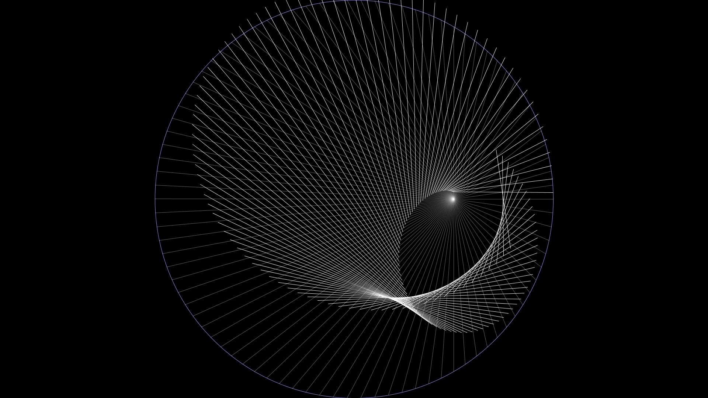

# Ellipse from Circle

Define a circle, an eccentric point inside the circle and line segments starting from the point and ending at the circle's circumference.

Rotating every line around its mid-point by 90 degrees creates an ellipse with the center of the circle and the point as its focal points.

## Instructions

To run the simulation *[Processing](https://processing.org/)* needs to be installed.
After installation open *EllipseFromCircle.pde* and run.
While running, pressing the mouse button sets new point from which the lines are going to be created.

## Reference

- The topic was mentioned in the [video](https://www.youtube.com/watch?v=xdIjYBtnvZU&t=158s)

- The simulation was made in [Processing](https://processing.org/)
